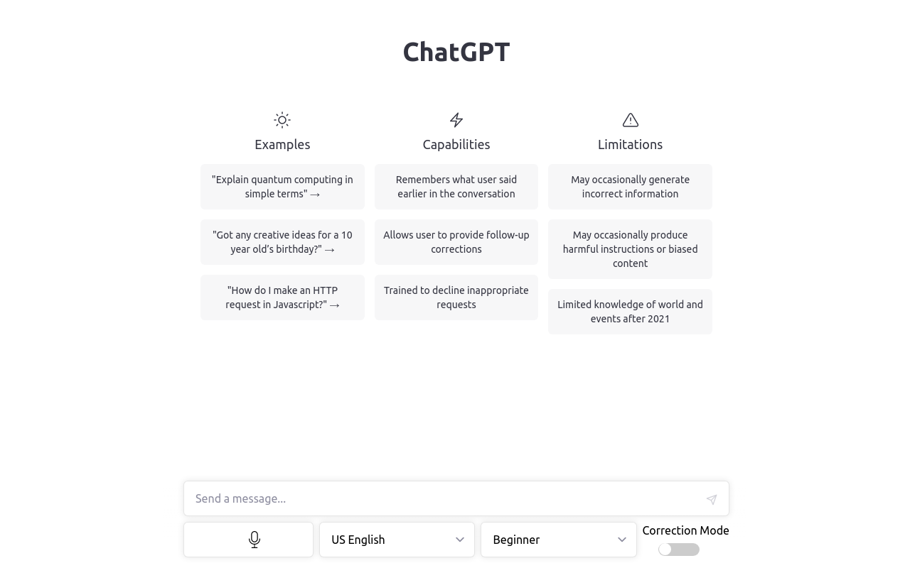

# Talk to GPT

A chrome extension that lets you use your microfone to talk to ChatGPT on [https://chat.openai.com/](https://chat.openai.com/)

---

## Microfone

When you click on the microfone button it starts to interpret what you say and transcribes it. If you click it again it stops recording and sends the promt to ChatGPT.

---

## Language Dropdown

This tells the interpreter what language you're speaking and in what language ChatGPT should respond in.

You can choose between these languages:

- Arabic (Saudi Arabia)
- Bangla (Bangladesh)
- Bangla (India)
- Czech (Czech Republic)
- Danish (Denmark)
- Austrian German
- "Swiss" German
- Standard German (as spoken in Germany)
- Modern Greek
- Australian English
- Canadian English
- British English
- Irish English
- Indian English
- New Zealand English
- US English
- English (South Africa)
- Argentine Spanish
- Chilean Spanish
- Colombian Spanish
- Castilian Spanish (as spoken in Central-Northern Spain)
- Mexican Spanish
- American Spanish
- Finnish (Finland)
- Belgian French
- Canadian French
- "Swiss" French
- Standard French (especially in France)
- Hebrew (Israel)
- Hindi (India)
- Hungarian (Hungary)
- Indonesian (Indonesia)
- "Swiss" Italian
- Standard Italian (as spoken in Italy)
- Japanese (Japan)
- Korean (Republic of Korea)
- Belgian Dutch
- Standard Dutch (as spoken in The Netherlands)
- Norwegian (Norway)
- Polish (Poland)
- Brazilian Portuguese
- European Portuguese (as written and spoken in Portugal)
- Romanian (Romania)
- Russian (Russian Federation)
- Slovak (Slovakia)
- Swedish (Sweden)
- Indian Tamil
- Sri Lankan Tamil
- Thai (Thailand)
- Turkish (Turkey)
- Mainland China, simplified characters
- Hong Kong, traditional characters
- Taiwan, traditional characters

---

## Language Level Dropdown

This tells ChatGPT to answer appropriately in relation to the specified language level.

---

## Correction Mode

This tells ChatGPT to correct any mistakes it finds in your prompt.

---

This extension focuses on speech related features. The options don't do anything unless you use the microfone button to talk to GPT.

However, as you will see, these options merely tweak your prompt in a specific way, so you can just copy the instructions that get prepended to your prompt as soon as you hit the microfone button and then type out your prompt.
