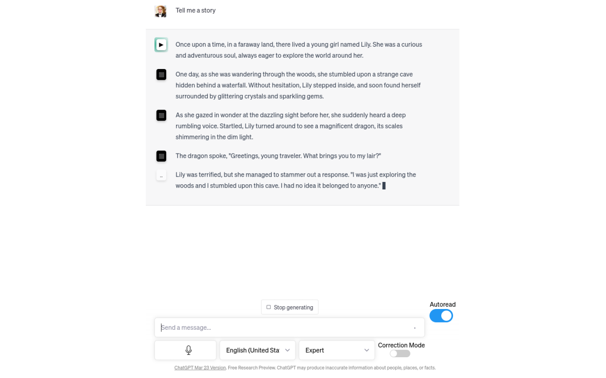

# Talk to GPT

A chrome extension that lets you use your microfone to talk to ChatGPT on [https://chat.openai.com/](https://chat.openai.com/)

---

## General Usage

To have the extension listen to what you are saying, click on the Microfone button. The Microfone Icon will turn red once it is recording. Anything you speak into your microfone will get translated into text and put into the message box. To stop listening, click on the microfone button again. This will send the prompt to ChatGPT. If you wish to modify the prompt with text, you will have to keep the microfone enabled while you type, since it automatically sends the prompt once you press the button to stop listening.

There is no automatic language inferrence of your speech. You will have to select the language you are speaking in manually from the selection menu next to the microfone button. As such, any text spoken in a language other than the specified one will not be recognized but instead interpreted in the chosen language, resulting in gibberish.

---

## Microfone

When you click on the microfone button it starts to interpret what you say and transcribes it. If you click it again it stops recording and sends the promt to ChatGPT.

---

## Language Dropdown

This tells the interpreter what language you're speaking and in what language ChatGPT should respond in.

You can choose between any language that is supported by the browsers specific SpeechRecognition Api:

+ Afrikaans af
+ Basque eu
+ Bulgarian bg
+ Catalan ca
+ Arabic (Egypt) ar-EG
+ Arabic (Jordan) ar-JO
+ Arabic (Kuwait) ar-KW
+ Arabic (Lebanon) ar-LB
+ Arabic (Qatar) ar-QA
+ Arabic (UAE) ar-AE
+ Arabic (Morocco) ar-MA
+ Arabic (Iraq) ar-IQ
+ Arabic (Algeria) ar-DZ
+ Arabic (Bahrain) ar-BH
+ Arabic (Lybia) ar-LY
+ Arabic (Oman) ar-OM
+ Arabic (Saudi Arabia) ar-SA
+ Arabic (Tunisia) ar-TN
+ Arabic (Yemen) ar-YE
+ Czech cs
+ Dutch nl-NL
+ English (Australia) en-AU
+ English (Canada) en-CA
+ English (India) en-IN
+ English (New Zealand) en-NZ
+ English (South Africa) en-ZA
+ English(UK) en-GB
+ English(US) en-US
+ Finnish fi
+ French fr-FR
+ Galician gl
+ German de-DE
+ Hebrew he
+ Hungarian hu
+ Icelandic is
+ Italian it-IT
+ Indonesian id
+ Japanese ja
+ Korean ko
+ Latin la
+ Mandarin Chinese zh-CN
+ Traditional Taiwan zh-TW
+ Simplified China zh-CN ?
+ Simplified Hong Kong zh-HK
+ Yue Chinese (Traditional Hong Kong) zh-yue
+ Malaysian ms-MY
+ Norwegian no-NO
+ Polish pl
+ Pig Latin xx-piglatin
+ Portuguese pt-PT
+ Portuguese (brasil) pt-BR
+ Romanian ro-RO
+ Russian ru
+ Serbian sr-SP
+ Slovak sk
+ Spanish (Argentina) es-AR
+ Spanish(Bolivia) es-BO
+ Spanish( Chile) es-CL
+ Spanish (Colombia) es-CO
+ Spanish(Costa Rica) es-CR
+ Spanish(Dominican Republic) es-DO
+ Spanish(Ecuador) es-EC
+ Spanish(El Salvador) es-SV
+ Spanish(Guatemala) es-GT
+ Spanish(Honduras) es-HN
+ Spanish(Mexico) es-MX
+ Spanish(Nicaragua) es-NI
+ Spanish(Panama) es-PA
+ Spanish(Paraguay) es-PY
+ Spanish(Peru) es-PE
+ Spanish(Puerto Rico) es-PR
+ Spanish(Spain) es-ES
+ Spanish(US) es-US
+ Spanish(Uruguay) es-UY
+ Spanish(Venezuela) es-VE
+ Swedish sv-SE
+ Turkish tr
+ Zulu zu

---

## Language Level Dropdown

This tells ChatGPT to answer appropriately in relation to the specified language level.

---

## Correction Mode

This tells ChatGPT to correct any mistakes it finds in your prompt.

---

## Auto Read

When enabled, the answers ChatGPT generates are read out as they are generated.

---

This extension focuses on speech related features. The options don't do anything unless you use the microfone button to talk to GPT.

However, as you will see, these options merely tweak your prompt in a specific way, so you can just copy the instructions that get prepended to your prompt as soon as you hit the microfone button and then type out your prompt.
